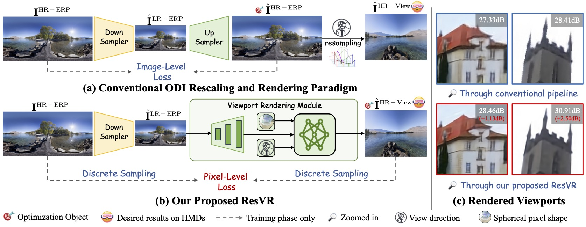

<div align="center">
<h3>[ACM MM 2024 Best Paper Nomination] 

ResVR: Joint Rescaling and Viewport Rendering of Omnidirectional Images
</h3>


[](https://dl.acm.org/doi/10.1145/3664647.3680801) [](https://arxiv.org/pdf/2404.16825)


[Weiqi Li](https://scholar.google.com/citations?user=SIkQdEsAAAAJ), Shijie Zhao, Bin Chen, Xinhua Cheng, Junlin Li, Li Zhang and [Jian Zhang](https://jianzhang.tech/)

*School of Electronic and Computer Engineering, Peking University*

*ByteDance Inc.*
</div>


## 🔥 Introduction
Proposed ResVR compared to previous ODI rescaling and viewport rendering paradigms. (a) Conventional methods focus on improving the quality of rescaled ERP images, resulting in inferior visual experiences. (b) Considering the fact that the desired content viewed on HMDs is a rendered viewport instead of an ERP image, our ResVR directly optimizes the quality of the final viewport for users through a novel discrete pixel sampling strategy and a spherical pixel shape representation technique. (c) Visual and PSNR comparisons of rendered viewports between the two pipelines in (a) and (b) on HMDs. 

<p align="center">
  
</p>

## 📰 **News and Updates**

- [2024/10/24] ResVR is nominated for best paper awards!
- [2024/07/26] ResVR is selected as an oral presentation!
- [2024/07/16] ResVR is accepted by ACM MM 2024.


## ✏️ To Do List
- [ ] Release inference code and weights
- [ ] Release training code
- [x] Release the paper

## 🤗 Acknowledgements
We appreciate the releasing code of [HyperThumbnail](https://github.com/AbnerVictor/HyperThumbnail), [LTEW](https://github.com/jaewon-lee-b/ltew) and [LIIF](https://github.com/yinboc/liif).

## Citation
If you find the code helpful in your research or work, please cite the following paper:
```
@inproceedings{li2024resvr,
  title={ResVR: Joint Rescaling and Viewport Rendering of Omnidirectional Images},
  author={Li, Weiqi and Zhao, Shijie and Chen, Bin and Cheng, Xinhua and Li, Junlin and Zhang, Li and Zhang, Jian},
  booktitle={Proceedings of the 32nd ACM International Conference on Multimedia (ACM MM)},
  pages={78--87},
  year={2024}
}
```